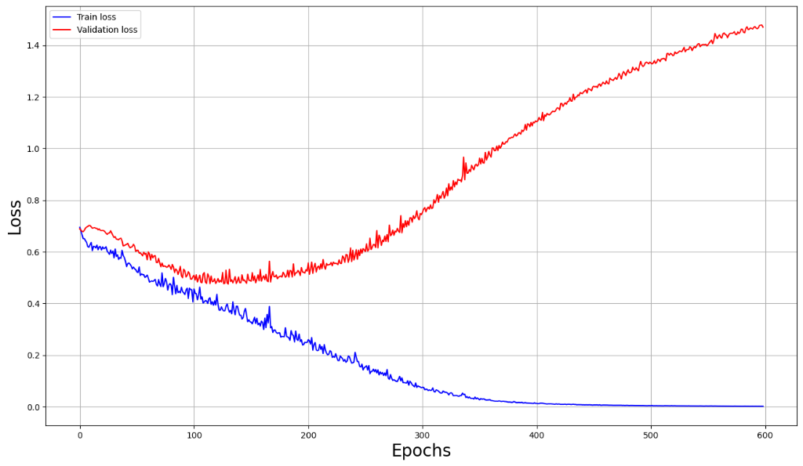
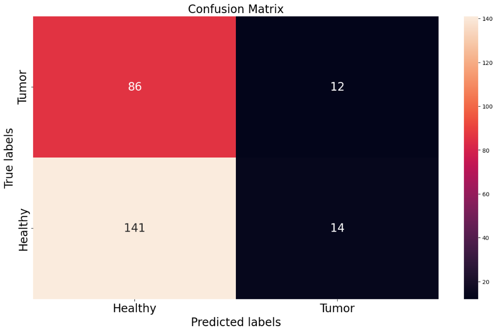
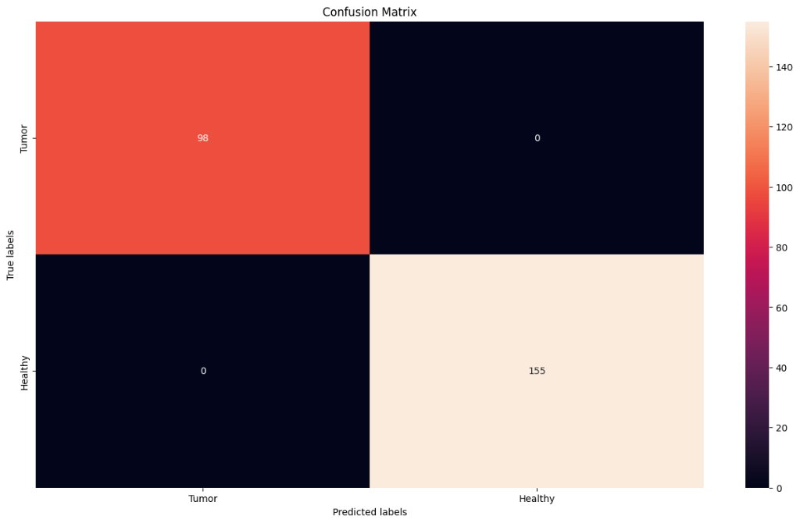
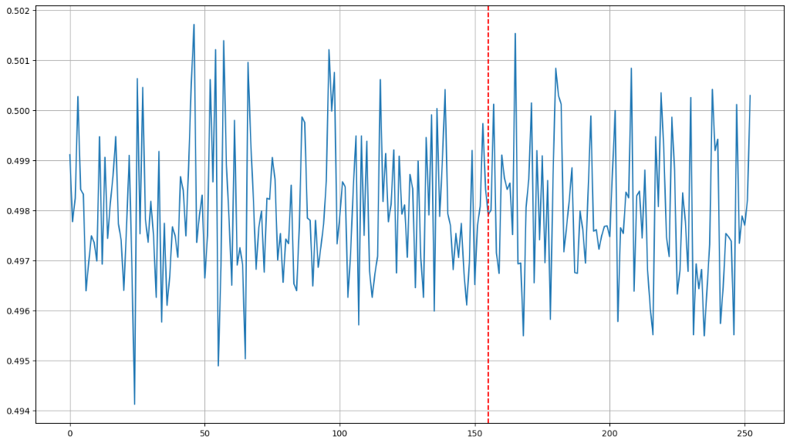

# Brain Tumor Classification Model 

Ce projet implémente un modèle de Deep Learning (CNN) capable de détecter la présence d'une tumeur cérébrale à partir d'images IRM.

## Aperçu du Projet

Le modèle utilise des techniques de vision par ordinateur pour classer les scans IRM en deux catégories : **Tumor** (Tumeur) et **Healthy** (Sain). L'objectif est de fournir un outil d'aide au diagnostic rapide et fiable.

## Résultats et Performance

Le modèle a été entraîné sur un dataset d'images IRM et a montré les performances suivantes :

### 1. Courbe de Perte (Loss Curve)
La courbe montre l'évolution de la perte d'entraînement et de validation au fil de 600 époques.


### 2. Matrices de Confusion
Les matrices de confusion illustrent la précision du modèle pour chaque classe. On observe une nette progression entre les phases de test initiales et finales.

| Test Initial | Test Final / Optimisé |
| :---: | :---: |
|  |  |

### 3. Visualisation des Prédictions
Voici une représentation graphique des prédictions effectuées par le modèle sur un échantillon de données.


### 4. Seuil de Classification
Visualisation du processus de décision binaire (0 ou 1) basé sur le score de confiance.


## Structure du Projet

- `main.ipynb` : Le notebook contenant l'intégralité du code (chargement, prétraitement, architecture, entraînement et évaluation).
- `Data/brain_tumor_dataset/` : Le dataset contenant les images `yes/` (tumeur) et `no/` (sans tumeur).
- `model/brain_tumor_model.pth` : Le poids du modèle sauvegardé après entraînement.
- `assets/` : Contient les graphiques et visualisations de performance.

## Installation et Utilisation

### Prérequis
```bash
pip install -r requirements.txt
```

### Exécution
Ouvrez `main.ipynb` avec Jupyter Notebook ou VS Code et exécutez les cellules séquentiellement pour reproduire les résultats ou tester le modèle sur de nouvelles données.

## Dépendances
- PyTorch
- NumPy
- Matplotlib
- Seaborn
- OpenCV
- Scikit-learn
